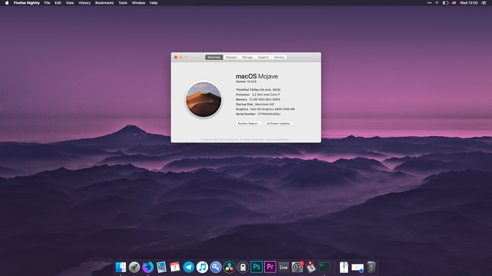

# Clover folder, kexts and fixes for Thinkpad T440p

This repo is mostly based on https://github.com/ameeno/Lenovo-Thinkpad-T440P-Hackintosh with several changes:

* Three different versions of VoodooPS2Controller.kext:
  * Synaptics trackpad (default)
  * Alps trackpad, Caps Lock and Escape swapped
  * Alps trackpad
* Special config.plist for USBInjectAll to support docking station USB ports

#### If you have an Alps trackpad, check out the "Alps drivers" folder

TODO:
* Docking station audio
* Address reboots when trying to suspend on docking station
